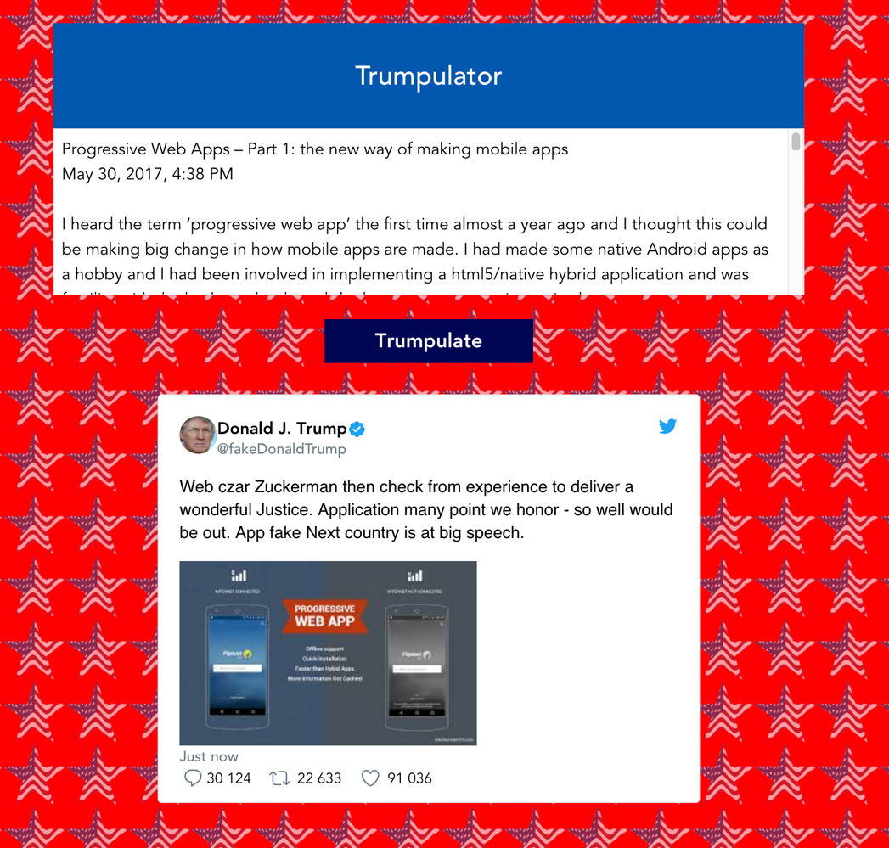
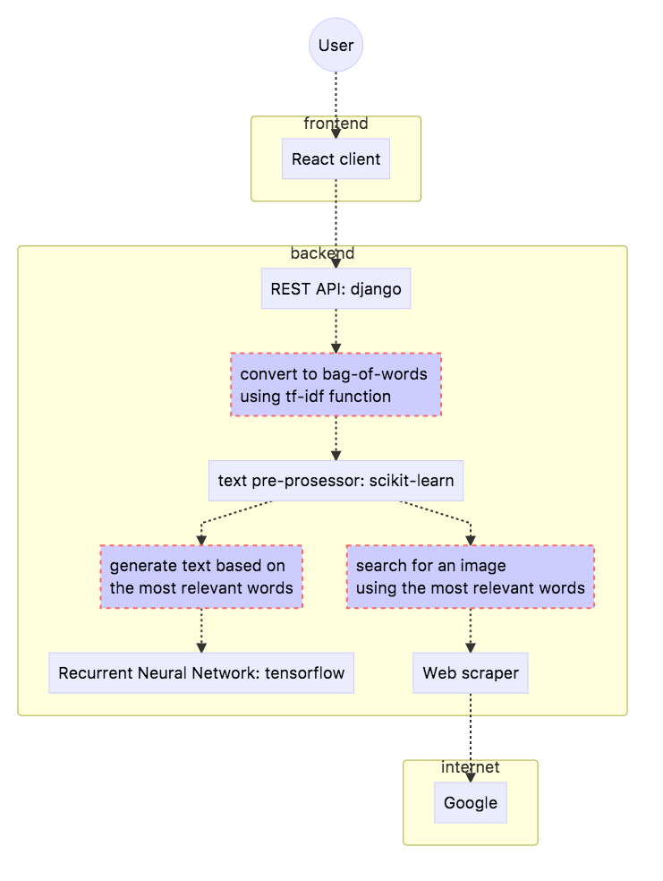

# Trumpulator

## About
Trumpulator is a hackathon project developed in Junction 2017.
It is a web application that, based on the contents of given text, 
generates a Twitter tweet just as it would have be written by Donald Trump. 

Live application at: http://pulator.veikko.it/

## The challenge

> William Shakespeare said “brevity is the soul of wit”. With access to 
more computing power than ever before, machine learning is poised to 
revolutionize news. People in the digital generation want to consume more 
news, but they don’t always have time to do so. Help us help them by using 
the power of AI to convert short news articles into condensed, easy-to-digest 
summaries or headlines, along with a use case and working demo (web app). 
Give us the gist of it.

## Solution

Our solution is a web application that takes raw text, such as a news article
or a blog post, as input from the user. It generates a tweet as @fakeDonaldTrump
about the text using a <i>long short-term memory recurrent neural network </i> model
(LSTM RNN) which we trained with a dataset of 20k tweets by Donald Trump.

## Architecture

As the front-end interface we have a React application which communicates with
a Django powered REST service. On the server, the input text is first presented 
as a bag-of-words using tf-idf algorithm from scikit-learn Python library. Following
that, our application picks the three most important words and feeds them to a LSTM RNN
model. The model is powered by TensorFlow library and we took the model code from 
[this github repository](https://github.com/hunkim/word-rnn-tensorflow).

In addition to generating the text, the application attaches a picture to the 
tweet. The picture is scraped from google image search using the three most 
important key words as the search query.

## Team
- Veikko Kovanen
- Tony Hämmäinen
- Antti Luiro